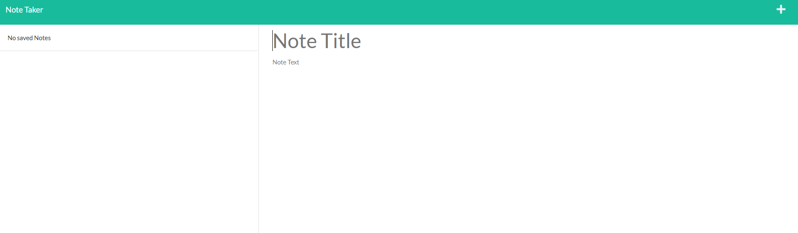
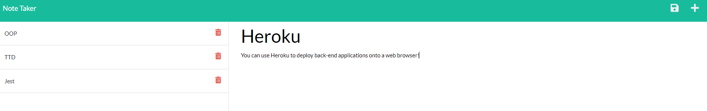
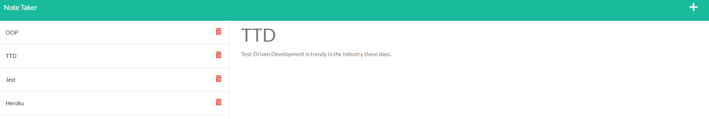
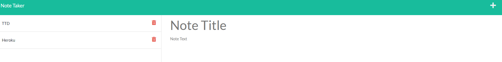

# Note Taker

The purpose of this assignment was to apply our new knowledge of back-end server creation and combine it with front-end technology through the use of Express.js.

## Description

For this challenge, we were required to create an application that allows a user to save and organize notes. As part of this challenge, we had to build API routes that both sent and retrieved data from a back-end server, allowing a user to interact with the application. Specifically, notes were saved in a JSON file. This back-end functionality was linked to front-end code that was already provided by the challenge. Once the application was complete, we were able to deploy it through the Heroku platform.

## Installation/Usage

In order to use this application, go to the following link: https://ancient-coast-10343.herokuapp.com/. That will direct you to a landing page, where you can click on the "Get Started" button. Once there, you may click on the main body section to provide both a "Note Title" and "Note Text". A save button will only appear on the top right if both sections are provided. You can review previous notes that are saved on the left-hand column by clicking on them. After clicking on a previous note, you can still add a new note by clicking on the "plus symbol" on the top right. You may also delete notes by clicking on their corresponding "red trashcan" button.

## Reflection

As with the other challenges in the 2nd trimester of this bootcamp, it was difficult figuring out where to begin.  There were so many moving parts that I had to piece together. Then, I realized that the starter code did not have a server.js file like the module did.

Continuing to use the module as a guide, I decided to figure out hwo to deploy to Heroku first. It was important that I am able to see my progress on a web browser.

Once that was done, there came the vital task of building POST and GET routes between the front and back-end. This part of the challenge was most time-consuming because I struggled to figure out how to provide each new note with its own ID. Furthermore, it was tricky making sure all of the files properly connected with each other through "exports", "require, and the "app" functionality.

Nevertheless, I was able to solve those issues, which gave me the confidence to figure out how to delete notes. Once again, the IDs were an issue because updating the IDs of remaining notes initially resulted in non-string IDs, which did not comply with the rest of the code.  However, some careful thinking and a slight adjustment made everything work just fine.

## Screenshots

Here is the application without notes:

The application while notes are being created:

Viewing a saved note:

After notes are deleted:

